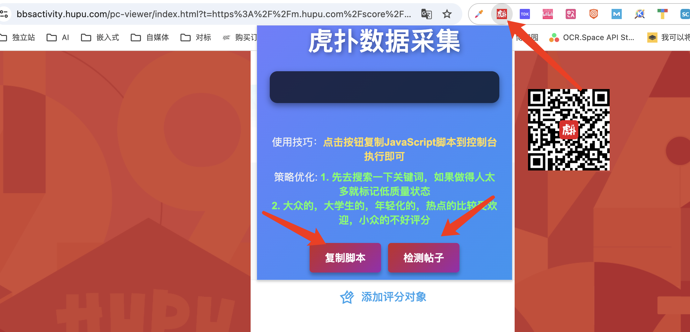
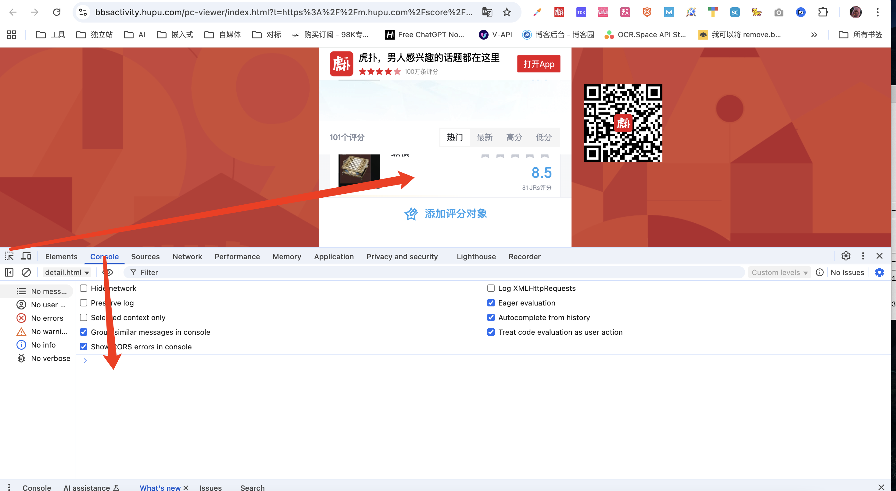
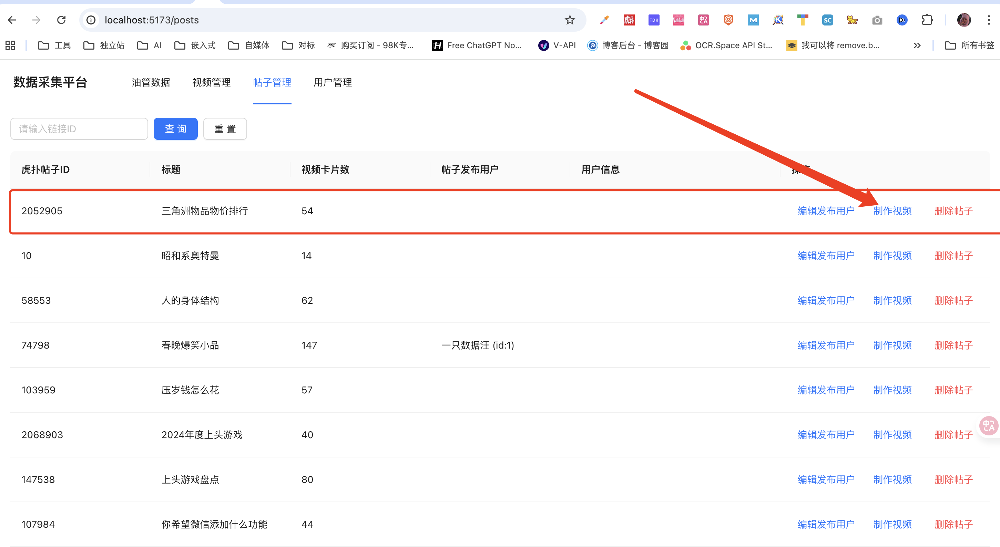
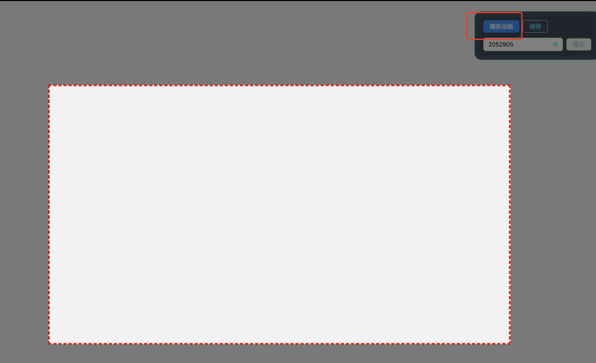
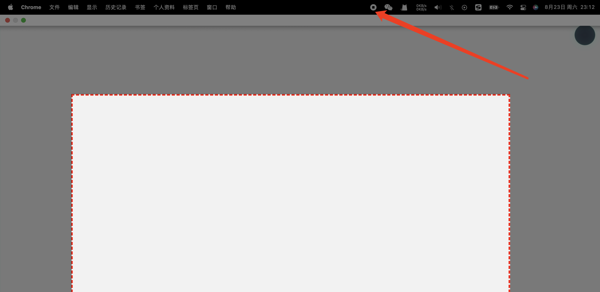
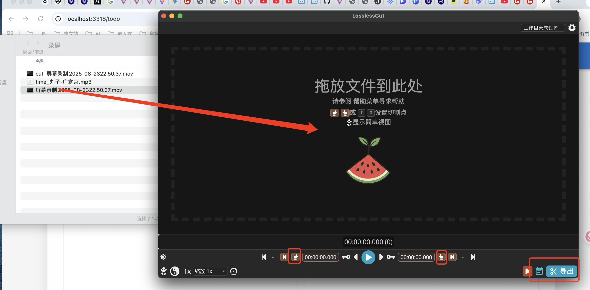
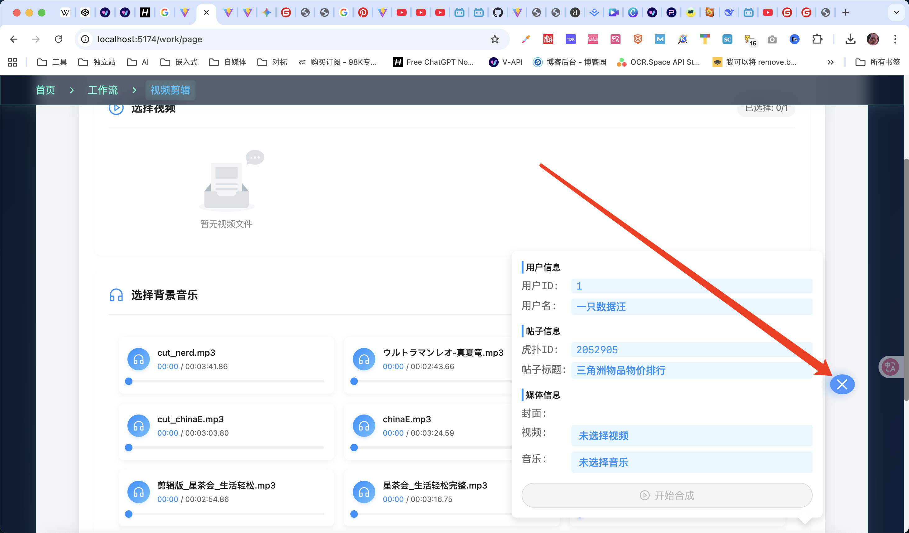
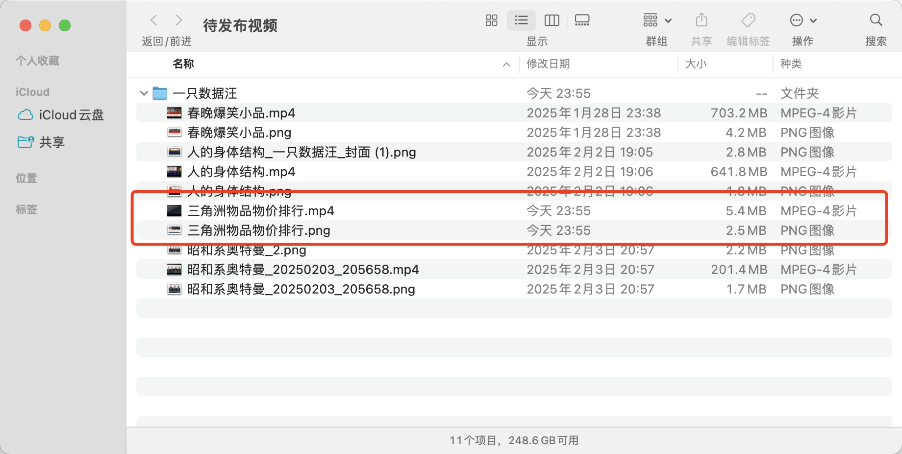

# 如何做虎扑视频

## 01 拿到链接
先去手机虎扑app找到评分帖子，拿到分享链接

或者直接在 副业-待办网站里拿

## 02 检测数据
电脑浏览器打开链接，右上角点击虎扑插件，检测帖子

检测成功可采集的话点击复制脚本，开始提取数据。

如果展示已有数据那么说明采集过了，不要复制脚本了，直接去采集网站点击制作视频即可

## 03 采集数据
双击鼠标点击检查打开控制面板，点击左下方箭头，把箭头按一下激活页面

然后把点击面板的Console选项，脚本贴到面板里，按下回车键，开始提取数据

## 04 制作视频
去[数据采集平台](http://localhost:5177/posts){:target="_blank"}  
找到刚刚采集的数据，点击去制作，即可跳转到视频录制页面

## 05 录制视频
进入视频录制页面后，点击全屏
再点击command+shift+5, 把录制框从外围压线到视频框，点击开始录制，再点击右侧的播放按钮，等待录制完成

录制完成后点击最上方的关闭按钮完成录制

## 06 生成封面

按ese退出，在视频制作平台选择 视频封面 -> 虎扑封面

点击生成封面按钮即可

## 07 稍微剪辑
打开losslesscut，command+空格，搜录屏，选择录屏文件夹，找到文件，拖到losslesscut里
稍微掐头去尾剪辑一下导出

## 08 合成待发布视频
导出之后，进入工作台页面，在工作流->视频剪辑里选择视频和背景音乐，点击生成
看到生成成功的提示即说明已经成功生成

## 09 发布
最后在按command+空格， 搜待发布视频， 即可发现所有上传资源都在， 直接拿去上传即可

