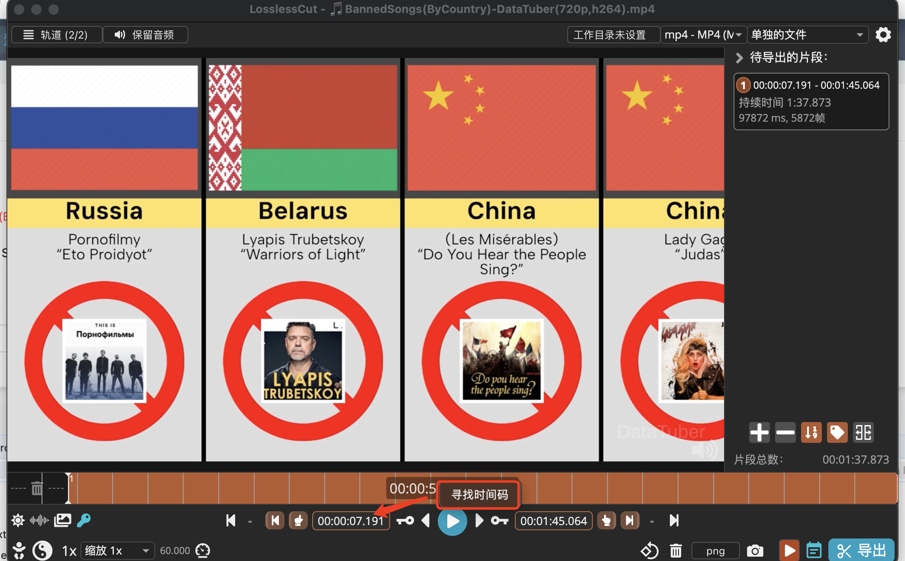

## 

1.选择视频，点击准备剪辑
2.打开losslesscut, 剪辑掉开头，直至第一屏开始

3.点击准备完成，点击设置本次任务名，要按顺序设置

# 如何做外网

新需求：
实现一个工作流，分两块：任务设置、素材提取，这块做成一个tab切换，我用到的技术是react tsx, antd, mui, react hooks, 你需要基于这些技术做一个MetaPicker.tsx的组件

页面初始化：
页面初始化的时候通过get请求http://localhost:3123/api/youtube/getYoutubeData拿的videoName字段，填到页面顶部title里(这个title在tabs上方，是全局的，不受tabs切换影响)

第一点任务设置，流程如下：
1.选择任务视频，下面是一个上传按钮，点击拿到视频名字
2.准备裁剪，下面是一个准备裁剪按钮，点击完了之后会发送一个请求给后端，同时会把第一步拿到的视频名字返回给后端
3.设置是否裁剪完成，下面用户可以选择是和否，选择是，则给出设置当前任务的输入框，输入框默认值是请求里的videoName，点击完成按钮，则把用户设置好的任务发送给后端，然后拿到后端请求返回的videoName渲染到页面最顶部的title以及输入框里

第二点素材提取，流程如下：
1.首先视频尺寸是1280 × 720，要做的是把视频按原尺寸渲染到页面上
2.暂时先把以上功能完成吧

1. 拿到当前任务，当前任务来自于请求

步骤
1. 选择视频，点击移动到losslesscut文件夹，开始lossless剪切
2. 去losslesscut, 切好首屏，然后去页面点击我已切好，设置本次任务文件名，003开头
3. 计算一屏时长，在页面微调，然后点击开始提取每屏图片，一屏满，则刚好，一屏不满，那么切一屏-1图，剩下的截掉
4. 点击浏览效果，弹窗浏览截图效果
5. 点击开始素材截取，记录绘制坐标，复制给每个素材，尾屏除外要单独绘制，然后开始各个素材微调

考虑要不要留黑边，留点黑边误差可测的其实，但是有border不留也行，优先不留吧
素材截图的时候，左边大点，右边小点，按最小来。
考虑react-canvas那个库应该是按原像素来拖拽和写坐标的，canvas也是按原素材大小渲染的，应该没有问题？但是原视频是1960比例的，屏幕或许没这么宽？我试试
看了下是1280×760应该是没问题的，前提要关掉控制台

## 01 下载视频
去待办任务里找到外网视频

## 02媒体元素提取

分为一屏满和一屏不满，一屏不满那就取图片-1作为一屏

以前用的ffmpeg转
每次视频提取帧图片都特别慢
现在使用video标签+cavas绘制来提取帧图片，可见即可得
而且canvas支持不播放视频也能提取图片，大大缩短了作业时间

总结流程
1.使用canvas截每屏图片，但是很快所以也没关系。开发一个弹窗看截图效果，背景色可选透明或白色、黑色、红色、蓝色
2.使用sharp提取计算图片

~~~js
<!DOCTYPE html>
<html lang="zh-CN">
<head>
    <meta charset="UTF-8">
    <title>不播放视频，截取指定时刻画面</title>
</head>
<body>

    <video id="myVideo" crossorigin="anonymous" width="640" height="360" muted>
        <source src="your_video.mp4" type="video/mp4">
        您的浏览器不支持 video 标签。
    </video>

    <br>
    <button id="captureBtn">截取第5秒的画面</button>

    <canvas id="myCanvas" style="display: none;"></canvas>

    <script>
        const video = document.getElementById('myVideo');
        const canvas = document.getElementById('myCanvas');
        const captureBtn = document.getElementById('captureBtn');

        // 设置跨域属性
        video.setAttribute('crossorigin', 'anonymous');
        
        captureBtn.addEventListener('click', () => {
            // 目标时间：5秒
            const targetTime = 5;

            // 监听 seeked 事件，确保跳转完成后再截图
            const onSeeked = () => {
                // 设置 Canvas 尺寸与视频一致
                canvas.width = video.videoWidth;
                canvas.height = video.videoHeight;
                const context = canvas.getContext('2d');
                
                // 将视频当前帧绘制到 Canvas 上
                context.drawImage(video, 0, 0, canvas.width, canvas.height);
                
                // 从 Canvas 导出图片数据并创建下载链接
                const dataURL = canvas.toDataURL('image/png');
                const link = document.createElement('a');
                link.href = dataURL;
                link.download = 'video_screenshot.png';
                link.click();

                // 移除监听器，避免重复触发
                video.removeEventListener('seeked', onSeeked);
                console.log(`第 ${targetTime} 秒的画面已成功保存。`);
            };

            // 注册监听器
            video.addEventListener('seeked', onSeeked);

            // 设置视频时间，触发跳转
            video.currentTime = targetTime;
        });

        // 确保视频元数据加载完成后才能进行操作
        video.addEventListener('loadedmetadata', () => {
            console.log('视频元数据已加载，可以进行截图。');
        });
    </script>

</body>
</html>
~~~

截取间隔帧
```js
const video = document.getElementById('myVideo');

function jumpToTime(minutes, seconds, milliseconds) {
    const totalSeconds = minutes * 60 + seconds + milliseconds / 1000;

    // 将总秒数赋值给 currentTime
    video.currentTime = totalSeconds;
}

// 示例：跳转到 1分10秒150毫秒
jumpToTime(1, 10, 150);
```

截取首尾帧
```js
<!DOCTYPE html>
<html lang="zh-CN">
<head>
    <meta charset="UTF-8">
    <title>截取视频开始和结束画面</title>
    <style>
        body {
            font-family: Arial, sans-serif;
            display: flex;
            flex-direction: column;
            align-items: center;
            padding: 20px;
        }
        video {
            border: 1px solid #ccc;
            box-shadow: 0 0 10px rgba(0,0,0,0.1);
        }
        button {
            margin-top: 15px;
            padding: 10px 20px;
            font-size: 16px;
            cursor: pointer;
            background-color: #007bff;
            color: white;
            border: none;
            border-radius: 5px;
        }
        .screenshots-container {
            margin-top: 20px;
            display: flex;
            gap: 20px;
            justify-content: center;
        }
        .screenshot {
            text-align: center;
        }
        .screenshot img {
            border: 1px solid #ddd;
        }
    </style>
</head>
<body>

    <video id="myVideo" crossorigin="anonymous" width="640" height="360" muted>
        <source src="your_video.mp4" type="video/mp4">
        您的浏览器不支持 video 标签。
    </video>

    <button id="captureBtn">截取开始和结束画面</button>

    <div class="screenshots-container">
        <div class="screenshot">
            <h4>开始画面</h4>
            <canvas id="startCanvas" width="320" height="180" style="border: 1px solid #ccc;"></canvas>
        </div>
        <div class="screenshot">
            <h4>结束画面</h4>
            <canvas id="endCanvas" width="320" height="180" style="border: 1px solid #ccc;"></canvas>
        </div>
    </div>

    <canvas id="hiddenCanvas" style="display: none;"></canvas>

    <script>
        const video = document.getElementById('myVideo');
        const captureBtn = document.getElementById('captureBtn');
        const startCanvas = document.getElementById('startCanvas');
        const endCanvas = document.getElementById('endCanvas');
        const hiddenCanvas = document.getElementById('hiddenCanvas');

        // 确保视频的 cross-origin 属性被设置
        video.setAttribute('crossorigin', 'anonymous');
        let isCapturing = false;

        // 辅助函数：将视频帧绘制到 Canvas
        const drawFrameToCanvas = (targetCanvas) => {
            const context = targetCanvas.getContext('2d');
            targetCanvas.width = video.videoWidth;
            targetCanvas.height = video.videoHeight;
            context.drawImage(video, 0, 0, video.videoWidth, video.videoHeight);
        };

        // 核心函数：处理截图逻辑
        const captureFrames = () => {
            if (isCapturing) return;
            isCapturing = true;
            captureBtn.disabled = true;
            captureBtn.textContent = '正在截取...';

            // 步骤 1: 监听 seeked 事件，第一次触发时截取开始帧
            const captureStartFrame = () => {
                video.pause();
                drawFrameToCanvas(startCanvas);
                console.log('开始画面已截取。');

                // 移除监听器，并准备截取结束帧
                video.removeEventListener('seeked', captureStartFrame);
                
                // 步骤 2: 再次监听 seeked，第二次触发时截取结束帧
                const captureEndFrame = () => {
                    video.pause();
                    drawFrameToCanvas(endCanvas);
                    console.log('结束画面已截取。');

                    video.removeEventListener('seeked', captureEndFrame);
                    isCapturing = false;
                    captureBtn.disabled = false;
                    captureBtn.textContent = '截取开始和结束画面';
                };
                
                video.addEventListener('seeked', captureEndFrame);
                
                // 设置视频时间为结束，触发第二次跳转
                video.currentTime = video.duration;
            };

            video.addEventListener('seeked', captureStartFrame);

            // 设置视频时间为开始，触发第一次跳转
            video.currentTime = 0;
            video.play();
        };

        // 绑定按钮事件
        captureBtn.addEventListener('click', captureFrames);

        // 确保视频元数据加载完成后才能进行操作
        video.addEventListener('loadedmetadata', () => {
            console.log('视频元数据已加载，可以进行截图。');
        });
    </script>

</body>
</html>
```

### 差异化机会

📊 英雄联盟数据分析频道的差异化机会
深度对比：不仅展示数据，还可以用你的技术优势做跨赛区对比（LPL vs LCK英雄优先级）、时间维度对比（新版本前后英雄数据变化）。这是手动创作者难以实现的维度。

预测性内容：基于历史数据训练简单模型，预测下一个版本可能崛起或陨落的英雄（哪怕准确率只有60%），这类内容容易引发热议和期待。

实时热点响应：利用你的自动化系统，在职业比赛结束后1小时内发布“本场比赛中选手的英雄数据深度解析”，抢占热点流量。


