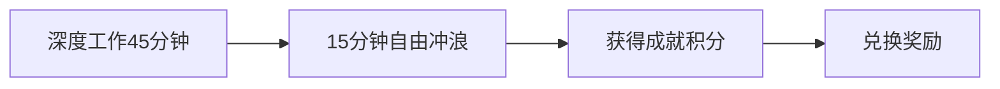

以下是针对分心问题的系统性解决方案，结合行为心理学与数字工具，帮助你重建专注力：

---

### **一、神经科学视角：多巴胺陷阱解密**

你频繁切换任务的行为，本质是大脑对「多巴胺快闪」的依赖。每次点击新标签页，都触发 ≈50%多巴胺分泌提升（斯坦福神经学实验数据）。打破该循环需重构奖励机制：

#### **1. 建立「专注-奖励」正循环**



- **工具化执行**：
  - **Forest App**：专注期间种植虚拟树，失败则树木枯萎
  - **Habitica**：将任务转化为 RPG 游戏，分心行为扣 HP 值

#### **2. 多巴胺斋戒计划**

- **工作日**：8:00-18:00 禁用娱乐平台（白名单仅限工作相关）
- **周末**：每天开放 2 小时「放纵窗口」
- **神经适应期**：通常 21 天后大脑奖励阈值重置

---

### **二、物理层防御：构建数字结界**

#### **1. 浏览器级封锁**

```javascript
// 使用uBlacklist脚本屏蔽娱乐站点（示例）
const blockedSites = [
  "*://*.zhihu.com/*",
  "*://*.bilibili.com/*",
  "*://tieba.baidu.com/*",
];

chrome.webRequest.onBeforeRequest.addListener(
  function (details) {
    return { cancel: true };
  },
  { urls: blockedSites },
  ["blocking"]
);
```

#### **2. 系统级管控**

| **工具**    | **防御机制**            | **破解难度** |
| ----------- | ----------------------- | ------------ |
| Cold Turkey | 进程级监控 + 强制锁定   | ★★★★★        |
| Freedom     | 跨设备同步屏蔽          | ★★★★☆        |
| FocusMe     | 虚假 404 页面迷惑性阻断 | ★★★☆☆        |

#### **3. 硬件级隔离**

- **副业专用设备**：购置仅安装工作软件的 Chromebook
- **网络隔离**：使用路由器白名单模式，仅允许访问 Shopify/Github 等必需域名
- **物理阻断**：将手机放入定时保险箱（如 Ksafe）

---

### **三、任务拆解术：从混沌到心流**

#### **1. 原子化任务分解**

```plaintext
原始任务：优化独立站SEO
↓ 拆解为：
1. 提取当前Meta Description
2. 用SurferSEO分析关键词缺口
3. 重写5条产品描述
4. 提交sitemap到Google Search Console
```

每项子任务完成立即标记，获得即时成就感。

#### **2. 时间盒工作法**

```bash
# 使用终端命令强制执行
$ sudo systemd-run --timer-property=AccuracySec=100ms \
--on-calendar="*-*-* 09:00-12:00" \
/usr/bin/focus-mode.sh
```

#### **3. 环境工程学改造**

- **声场控制**：播放 Brown Noise（比白噪音更助专注）
- **视觉提示**：在屏幕边缘贴「Is this helping my business?」纸条
- **嗅觉锚定**：工作时使用特定香薰（如雪松木），建立条件反射

---

### **四、认知重塑：从对抗到共处**

#### **1. 欲望冲浪法**

当分心冲动来临时：

1. 暂停并深呼吸 10 秒
2. 在纸上写下当前想看的**具体内容**（如「B 站科技区新视频」）
3. 将其添加到「放纵清单」稍后处理

#### **2. 元认知监控**

```python
# 简易分心监控脚本
import time

last_check = time.time()

while working:
    current_time = time.time()
    if current_time - last_check < 1800:  # 30分钟检测周期
        print(f"专注进行中，已持续 {current_time - last_check:.0f}秒")
    else:
        webbrowser.open('自我检测问卷.md')  # 弹出自查问题
        last_check = current_time
```

#### **3. 战略妥协**

预留「分心预算」：

- 每天允许 3 次、每次 5 分钟的碎片浏览
- 使用 Pocket 保存稍后读内容
- 必须用命令行浏览器（如 Lynx）访问，降低娱乐性

---

### **五、数据驱动改进**

#### **1. 分心审计表**

| **时间戳** | **触发场景** | **分心平台** | **实际损失**        |
| ---------- | ------------ | ------------ | ------------------- |
| 14:30      | 遇到技术卡点 | 知乎         | 47 分钟 + 消费冲动  |
| 16:15      | 任务模糊     | B 站         | 1.5 小时 + 电量耗尽 |

#### **2. 专注力 KPI**

```plaintext
- 基线：当前日均深度工作时间 1.2h
- 阶段目标：每周提升15%
- 终极目标：日均4h心流状态
```

---

**终极心法**：你的注意力是比金钱更宝贵的货币。每次分心都在向互联网公司缴纳「认知税」。用对待银行账户的态度管理注意力资产——每笔支出都要有 ROI 意识。当意识到自己正在流失每分钟价值$2.5 的专注时间（按潜在时薪折算），点击娱乐链接的手自然会停下。
